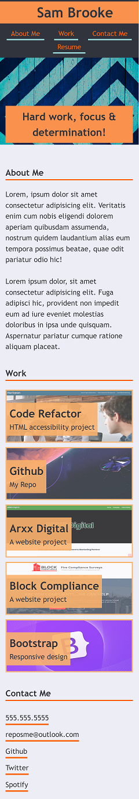
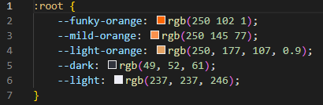

# Responsive Portfolio Challenge

## Description 

As a web developer it is important to showcase your work in order to demonstrate your skills & talent to prospective clients and/or employers.

I have developed a portfolio page to showcase some of my early work as a front-end web developer. The portfolio will be considered a 'live' project that will be developed to include further examples of my completed works as I progress my career. 

I have learned and applied the following aspects as part of this HTML & CSS project;

<ul> 
    <li><strong>CSS Flexbox</strong> to provide a neat layout.</li> 
    <li><strong>Media queries</strong> to provide responsive content suitable for a typical phone screen with a max. width of 480px.</li>
    <li><strong>CSS variables</strong> to define specific values to be reused throughout the portfolio.</li>
</ul> 

I also applied my own color scheme and have added some hover effects on the nav bar as well as the grid images.

### Result -  
<i>My portfolio page displays as intened on desktop screens, as below;</i>

<i>My portfolio page also displays as intended on mobile phone screens with a maximum width of 480px, as below;</i>
 

### Here is the deployed site; 
https://sam010000101.github.io/accessibility-review/

## Table of Contents

* [Installation](#installation)
* [Usage](#usage)
* [Credits](#credits)
* [License](#license)

## Installation

N/A

## Usage 
The css variables that I have used in my project are included at the top of the style.css, changing these enables a quick change of color scheme to the whole of the page, which is more efficient than having to change each selector in turn;

## Credits

This project was created in collaboration with my teamates, big shouts out to;
    <li>Victor  Biscio https://github.com/reinkaoss</li>
    <li>Vittoria Bugana https://github.com/vbugana</li>
    <li>Adama Sall</li>
    <li>Chris-Eric Dagbo</li>

## License

MIT License

Copyright (c) 2022 Sam Brooke

Permission is hereby granted, free of charge, to any person obtaining a copy
of this software and associated documentation files (the "Software"), to deal
in the Software without restriction, including without limitation the rights
to use, copy, modify, merge, publish, distribute, sublicense, and/or sell
copies of the Software, and to permit persons to whom the Software is
furnished to do so, subject to the following conditions:

The above copyright notice and this permission notice shall be included in all
copies or substantial portions of the Software.

THE SOFTWARE IS PROVIDED "AS IS", WITHOUT WARRANTY OF ANY KIND, EXPRESS OR
IMPLIED, INCLUDING BUT NOT LIMITED TO THE WARRANTIES OF MERCHANTABILITY,
FITNESS FOR A PARTICULAR PURPOSE AND NONINFRINGEMENT. IN NO EVENT SHALL THE
AUTHORS OR COPYRIGHT HOLDERS BE LIABLE FOR ANY CLAIM, DAMAGES OR OTHER
LIABILITY, WHETHER IN AN ACTION OF CONTRACT, TORT OR OTHERWISE, ARISING FROM,
OUT OF OR IN CONNECTION WITH THE SOFTWARE OR THE USE OR OTHER DEALINGS IN THE
SOFTWARE

---

## Badges

## Tests

Final landing page deployed & fully functional on desktop & mobile phone screen (<i>see Results section above for screenshots</i>)

---

© 2022 Trilogy Education Services, LLC, a 2U, Inc. brand. Confidential and Proprietary. All Rights Reserved.
